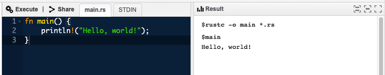
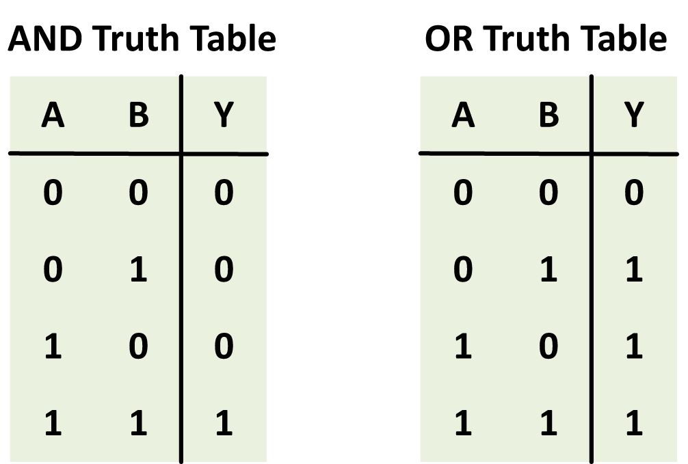
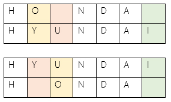

# Popular Languages in the Field

This workshop has been arranged for [DevFest '21](https://2021.devfe.st), but feel free to use it any way you like.

<hr/>

## Introduction

The purpose of this workshop is to expose you to the most commonly used programming languages by software developers in the industry, as of 2021, to jumpstart your learning process and to help make you feel less intimidated by technical jargon.

In the end, we hope to convey that programming languages are simply a means to an end, and that there is no clout from knowing 10+ languages. If you can understand the core concepts and components of one or a few languages, you will be well-equipped as a software engineer.

<hr/>

## Setup

To make this tutorial more accessible to all, we will be using online IDEs provided by Tutorialspoint for all languages in this tutorial. At the beginning of each section, please navigate to the appropriate IDE.

<hr/>

## Overview of Coding Languages

Before we begin previewing popular programming languages, let's refresh our minds on the core concepts prevalent across almost every single high-level programming language ever used.

### Command Line and I/O

Whereas programming languages enable us to make cool things like iPhone apps, Windows desktop programs, and Amazon Alexa Skills, the most rudimentary interface for building software is the **command line**.

When we write code in a text file using a text editor of our choice, we use tools to compile the code into a binary (0s and 1s) file understood by the computer, and then run this binary file through the command line.

In the TutorialsPoint IDE we will be interacting with the following UI, where the text editor is on the left and the command-line is on the right.


Suppose we want to provide an input into our program from an outside source (i.e. a file). We provide this input through the `STDIN` file descriptor, which we will discuss more about later. The output shown in the command-line comes from the `STDOUT` descriptor and, if there is an error, from the `STDERR` descriptor.


### Comments

Comments are the simplest form of code, and are used to provide memos and to-dos to your future self or future developers.

An inline comment in Python looks like this:
```
# My comment
```

... and in JavaScript and other popular languages looks like this:
```
// My comment
```

### Variables and Data Types

A variable is a container for storing the value of some data, just like in math. In Python, for instance, if we want `x` to be equal to `5`, we just need to write the following.
```
x = 5
```

In **strictly-typed** languages, variables need to have a certain type, and their type cannot be changed. In C++, the first line will compile, but the second would throw an error.
```
int x = 5;
x = "elephant";
```

In **loosely-typed** languages, variables do not need type declarations, and their types can be changed any time. In JavaScript, the following code would compile.
```
let x = 5
x = "elephant"
x = false
```

There are many different types of variables, especially in lower-level (but, still considered high-level!) languages like C.

#### `char`

`char`s are characters that take up 1 byte (8 bits) of memory in your computer, being the smallest variable.

Examples:
```
'A'
'b'
0
```

#### `boolean`

A `boolean` is generally a 4-byte variable that either represents a `true` (`1`) or a `false` (`0`) value. Some languages use `true` and `false` as keywords and other languages don't have them, so you need to use literal integers in this case.

Examples:
```
true
1
false
0
```

Sometimes, we use boolean logic. `&&` stands for "and" and `||` stands for "or." Suppose we have variables `A` and `B`. Then, we can use the following truth tables for AND and OR to figure out the result of the expressions `A && B` and `A || B`, respectively.




#### `string`

`string`s are a non-primitive list of characters, which form thigns like words or sentences. They take up (# of `char`s) + 1 bytes, with an extra byte being required for the string/null terminator `\0` to declare the string as having ended.

Examples:
```
"cat"
{ 'c', 'a', 't', '\0' }
```

#### `int`

An `int` is a whole number. When you round a number to an `int`, it is the same as the "floor" operation on a number (i.e. `4.8 --> 4`). `int`s vary in size across or within languages, being `2`, `4`, `8`, `16`, or more bytes in size.

Examples:
```
46
-13184
0
```

#### `float`/`double`

`float`s and `double`s are floating point numbers/numbers with decimal places. These usually provide a greater level of accuracy when representing information, but the computer is not so great at computing with them, so we get **precision errors**.

Examples:
```
1.23
-9.4
0.0
```

### Control Flow (If/Else)

"Control flow" is a fancy term for describing code that runs based on a **condition**. Suppose it may rain today. The following is the control flow for bringing an umbrella.

```
if (will_rain) {
    if (going_to_work) {
        bring_umbrella()
    } else {
        dont_bring_umbrella()
    }
} else {
    dont_bring_umbrella()
}
```

Sometimes, we need an intermediate condition to be tested. We can use `else if`.

```
if (will_rain) {
    if (going_to_work) {
        bring_umbrella()
    } else {
        dont_bring_umbrella()
    }
} else if (will_snow && going_to_work) {
    wear_snow_boots()
} else {
    dont_bring_umbrella()
}
```

### Loops

#### `for`-loop
A `for` loop is used for iterating over a sequence like a list or over a range of numbers.

Iterating from 0 to 4 in languages like C++ and Java looks like this:
```
for (int i = 0; i < 5; i++) {
    // Do something
}
```

Iterating over a list of strings in Python looks like the following.
```
dog_names = ["Pluto", "Comet", "Neptune"]
for dog in dog_names:
    print("Sit down, " + dog + "!")
```

#### `while`-loop

Another common loop (which is completely ommitted from languages like Go), is the `while` loop. This loop keeps executing whatever code is within its scope until the condition in the parentheses is no longer true.

```
i_am_full = false
while (!i_am_full) {
    i_became_full = eat()
    if (i_became_full) {
        i_am_full = true
    }
}
```

### Functions

A `function` is a block of code which only runs when it is called.

You can pass data, known as parameters, into a function.

A function can return data as a result.

The following function, `eat`, increases the amount of food consumed by an individual and returns `true` if the person ate too much. Otherwise, it returns `false`.
```
food_consumed = 0
stomache_capacity = 10

function eat() {
    food_consumed++
    if (food_consumed > stomache_capacity) {
        return true
    }
    return false
}
```

### Lists or Arrays

Lists are a group of contiguous variables in memory generally having the same type. Lists can grow and shrink.

Example:
```
[ 0, 10, 20, 30, 40, 50 ]
```

Arrays are simply lists that *cannot change in size*. We use these over lists sometimes because they are faster. In some languages, like JavaScript, there is no difference between the two, and lists are called "arrays."

### Objects, HashMaps, or Dictionaries

Objects, HashMaps, or Dictionaries are all variable types used to store data values in key:value pairs.

Suppose we had a competition where students recited as many digits of pi (3.1415...) as they remembered. If we want to store the results in a dictionary in Python (similar to an object in JavaScript), we could write the following:
```
{
    "Alex":     14,
    "Anthony":  13,
    "Bora":     14,
    "Lindsey":  19,
    "Whitney":  13
}
```

<hr/>

## Popular Languages

Now that we've briefly glossed over important coding concepts, we will now dive into four popular programming languages of 2021––Python, JavaScript, Go, and Rust––and write small programs in each language, for comparison.

<hr/>

### Let's Create "Autocorrect"

We will be using the concept of [Levenshtein Distance](https://en.wikipedia.org/wiki/Levenshtein_distance#:~:text=Informally%2C%20the%20Levenshtein%20distance%20between,considered%20this%20distance%20in%201965.) to create a function that autorrects a misspelled word into a correctly spelled word from a dictionary we create.

According to Wikipedia, Levenshtein Distance between two words is *the minimum number of single-character edits (insertions, deletions or substitutions) required to change one word into the other*.



### Python

[Click here](https://www.tutorialspoint.com/execute_python3_online.php) to begin coding in Python.

<hr/>

### JavaScript/Node.js

[Click here](https://www.tutorialspoint.com/execute_nodejs_online.php) to begin coding in JavaScript.

**Skeleton Code**
```js
// Source: https://gist.github.com/andrei-m/982927#gistcomment-1796676
String.prototype.levenshtein = function(string) {
    let a = this, b = string + "", m = [], i, j, min = Math.min;

    if (!(a && b)) return (b || a).length;

    for (i = 0; i <= b.length; m[i] = [i++]);
    for (j = 0; j <= a.length; m[0][j] = j++);

    for (i = 1; i <= b.length; i++) {
        for (j = 1; j <= a.length; j++) {
            m[i][j] = b.charAt(i - 1) == a.charAt(j - 1)
                ? m[i - 1][j - 1]
                : m[i][j] = min(
                    m[i - 1][j - 1] + 1, 
                    min(m[i][j - 1] + 1, m[i - 1 ][j]))
        }
    }

    return m[b.length][a.length];
}

console.log("bat".levenshtein("bar"))

const dictionary = [
    // TODO: fill the dictionary
]

function autocorrect(word) {
    // TODO: implement this
    return word
}

console.log(autocorrect("babana"))
```

View the solution code [here](./solutions/2-autocorrect.js).

<hr/>

### Go

[Click here](https://www.tutorialspoint.com/execute_golang_online.php) to begin coding in Go.

<hr/>

### Rust

[Click here](https://www.tutorialspoint.com/compile_rust_online.php) to begin coding in Go.

<hr/>

## Presented By

### Anthony Krivonos
[GitHub](https://github.com/anthonykrivonos)

### Alex Yao
[GitHub](https://github.com/alexwyao)

<hr/>

## Reference

Some descriptions and examples taken from [W3Schools](https://www.w3schools.com/).
